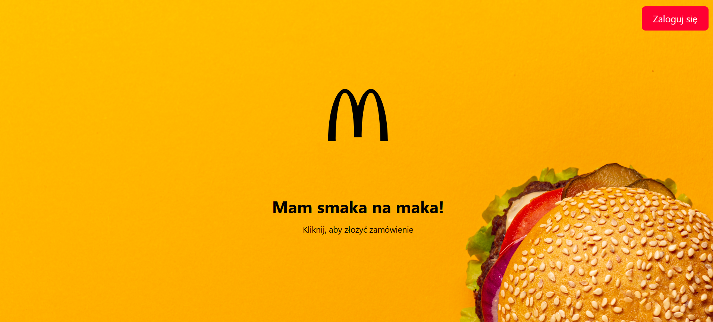
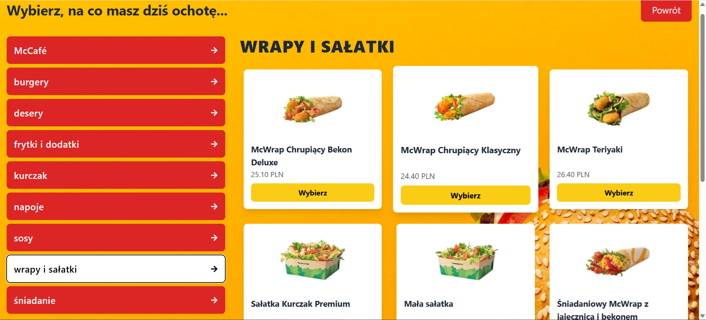
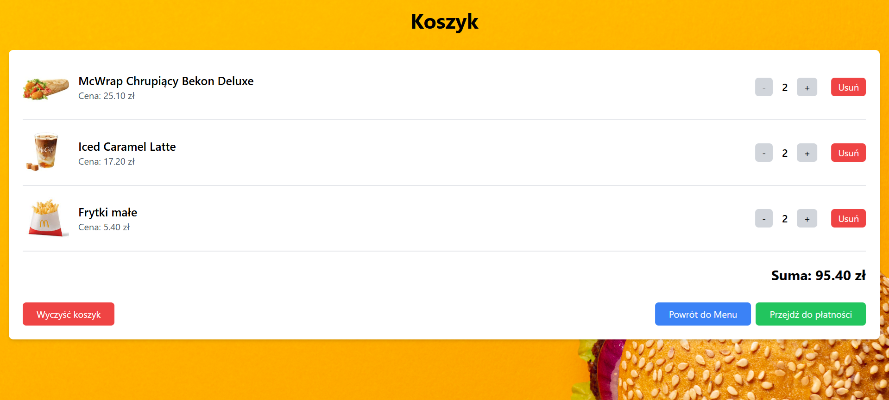
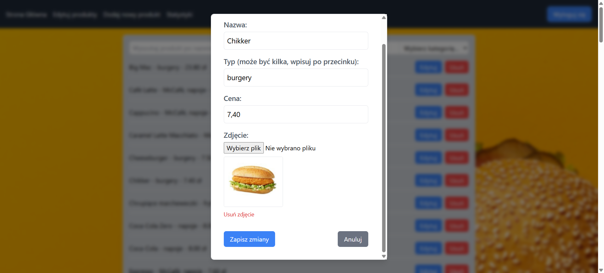

# Aplikacja do składania zamówień - kiosk McDonald's

### Autor: **Kacper Hołowaty**

> ⚠️**Ważne:** Wymaga zainstalowanego i uruchomionego Docker Desktop wraz z Kubernetes.

#### Pierwsze uruchomienie:

w pliku `backend/kubernetes/backend.yaml` (w 17 linijce) zamiast obrazu: **kacperholowaty/backend-maczek:latest**, skorzystaj z obrazu: **kacperholowaty/backend-maczek-dane:latest** w celu dodania początkowych produktów do menu. Po dodaniu można zmienić obraz na domyślny: **kacperholowaty/backend-maczek:latest**. 

## Uruchomienie aplikacji

Aby uruchomić aplikację, uruchom skrypt: **script.sh** (np. za pomocą polecenia: `./script.sh`). Aplikacja będzie działać na **http://localhost:32000**.

Jeśli chcesz zakończyć pracę z aplikacją wykonaj polecenia:

`kubectl delete deployment --all`

`kubectl delete services --all`

### Opis projektu:

#### 🚀 Użyte technologie

#### 📝 Opis

Aplikacja umożliwia użytkownikowi (bez konieczności logowania) składanie zamówień w restauracji McDonald's. Proces zamówienia rozpoczyna się od wyboru rodzaju realizacji zamówienia ('Na miejscu' lub 'Na wynos'), a następnie użytkownik może wybierać produkty z dostępnego menu, podzielonego na różne kategorie (np. napoje, burgery itp.). Istnieje możliwość dostosowania liczby zamawianych produktów. Użytkownik, po wyborze tego co chce zamówić, przechodzi do koszyka, gdzie otrzymuje podsumowanie zamówienia. Potem przechodzi do panelu płatności, a na końcu otrzymuje numer zamówienia.
Aplikacja posiada też panel administratora, gdzie po zalogowaniu dostępne są statystyki sprzedaży, a dodatkowo po zalogowaniu jako użytkownik z przypisaną rolą **admin**, można edytować produkty dostępne w menu restauracji. 

#### 🔐 Konfiguracja Keyclaok

Stworzono realm o nazwie: **mcdonalds-app**, klienta: **react-client** oraz użytkowników: **pracownik1**, **pracownik2** oraz **administrator**, gdzie jednemu z nich (*administrator*) przypisano wcześniej stworzoną rolę realma: **admin**, dzięki czemu, w panelu administratora, ma on możliwość edycji produktów dostępnych w menu restauracji. Użytkownicy *pracownik1* i *pracownik2*, również mogą zalogować się do panelu administratora, jednak mają oni dostęp jedynie do statystyk sprzedaży - możliwość edycji menu jest dla nich zablokowana. Każdy z użytkowników ma ustawione hasło, które jest wymagane przy logowaniu. Konfiguracja dostępna jest w pliku `kubernetes/keycloak/realm-export.json` i jest automatycznie aplikowana przy uruchamianiu kontenera Keycloak za pomocą Kubernetes.

#### 📸 Wygląd aplikacji

**Ekran startowy**

**Menu**

**Koszyk**

**Panel administratora - formularz edycji produktu**

